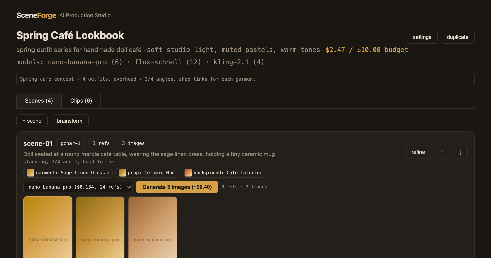

# SceneForge

[](https://github.com/ahmedkhaledmohamed/SceneForge/actions/workflows/ci.yml)



**AI production studio for character-driven content.** Concept to finished short-form video in one tool:

```
concept → AI shot list → scenes + refs → generate images → select → clips → sequence → export
```

Multi-reference AI image composition (up to 14 refs), smart model routing across 3 providers, one-click "Produce" and "AI Director" modes, platform-aware export, and full cost tracking. Built for content creators who need consistent character visuals across scenes.

## What makes it different

- **Multi-ref composition** — 8-14 reference images per scene (character + outfit + props + background) composed into one consistent image
- **AI Director** — describe your concept, AI plans the full shot list, generates everything, and creates clips automatically
- **Smart model routing** — "Auto" picks the optimal model per clip: Seedance for hero shots, Kling for B-roll, based on shot type + budget
- **Draft → Premium** — generate cheap drafts ($0.003), pick the best, one-click upgrade to premium ($0.134)
- **3 providers, 13 models** — Together AI, OpenRouter, RunPod (self-hosted). Switch per clip, not per platform
- **No subscription** — pay per generation only. No credits, no caps

## Studio

A React SPA backed by a FastAPI API. Everything runs from a single Docker image on Railway.

### The workflow

1. **Create a profile** — brand/workspace with global characters, style defaults, API keys
2. **New project** — from scratch, from a template, or let the AI Director plan it
3. **Add scenes** — describe each moment, drop reference images onto the card. Or use AI shot list / brainstorm
4. **Generate images** — multi-reference composition, multiple options per scene, auto-enhance with LLM
5. **Select + upgrade** — compare side by side, draft → premium upgrade with one click
6. **Create clips** — tag shot types, pick model (or Auto), set duration + motion prompt
7. **Sequence** — arrange clips in order, render into one video
8. **Export** — platform-optimized for TikTok, Reels, Shorts, Pinterest. AI-generated captions + hashtags

### Key features

| Feature | Description |
|---|---|
| **AI Director** | Concept → shot list → images → clips in one click |
| **Produce** | One-click pipeline: generate all scenes → auto-select → create clips |
| **Smart routing** | Auto picks optimal model per shot type + budget |
| **Prompt enhancement** | LLM expands short descriptions into detailed generation prompts |
| **Shot types** | Hero, detail, transition, B-roll, wide, overhead — each maps to a cost tier |
| **Draft → Premium** | Upgrade images/clips to better models without regenerating everything |
| **Batch generation** | Generate all scenes or all clips in parallel with progress tracking |
| **Sequence builder** | Arrange clips, preview, render into one video |
| **Platform export** | TikTok (9:16, 60s), Reels (90s), Shorts (60s), Pinterest (2:3) |
| **Caption generation** | AI-written captions + hashtags per platform with tone control |
| **Project templates** | Save/load project structures. 3 built-in: Product lookbook, Day in the life, Character series |
| **Shot list generator** | AI plans complete shot lists with compositions and shot types |
| **Cost tracking** | Per-artifact GPU cost, project budgets, estimated totals on every button |
| **Profile characters** | Global characters with refs shared across all projects |

## Models

13 models across 3 providers:

| Key | Kind | Price | Provider | Notes |
|---|---|---|---|---|
| `flux-schnell` | image | $0.003 | Together AI | fast drafts |
| `flux-2-pro` | image | $0.03 | Together AI | multi-ref (8 refs) |
| `nano-banana-pro` | image | $0.134 | Together AI | best quality (14 refs) |
| `seedance-1.5-pro` | video | $0.26/clip | OpenRouter | best value I2V |
| `seedance-2.0-or` | video | $0.52/clip | OpenRouter | most realistic |
| `kling-2.1` | video | $0.18/clip | Together AI | cheapest hosted I2V |
| `seedance-2.0` | video | $0.80/clip | Together AI | Seedance via Together |
| `veo-3.0-fast` | video | $0.40/clip | Together AI | mid-price |
| `runpod-wan-i2v` | video | ~$0.10/clip | RunPod | self-hosted Wan2.2 720p |

## Architecture

```
src/sceneforge/
├── server/api.py       82 API endpoints (profile-scoped)
├── project.py          project data model + JSON persistence
├── profile.py          profile data model (characters, keys, defaults)
├── ops.py              generation pipelines (images, clips, produce, direct)
├── prompts.py          prompt composition, enhancement, shot lists, captions
├── config.py           model registry, shot types, platforms, smart routing
├── stitch.py           ffmpeg normalize → xfade chain
└── backends/           together, openrouter, runpod, fake (tests)

frontend/               React SPA (Vite + TanStack Query + React Router)
runpod-worker/          RunPod serverless GPU worker
site/                   static landing page
```

192 tests, $0 cost (fake backends). 82 API endpoints. ~10K LOC.

## Deploy

```bash
# Railway (recommended — auto-deploy from GitHub, ~$5/month)
# 1. Connect repo at railway.app
# 2. Add volume at /data
# 3. Set env: TOGETHER_API_KEY, OPENROUTER_API_KEY, SCENEFORGE_PASSWORD
# 4. Deploy — Dockerfile handles everything

# Or Docker directly:
docker build -t sceneforge .
docker run -p 8000:8000 -v sceneforge-data:/data \
  -e TOGETHER_API_KEY=key -e SCENEFORGE_PASSWORD=pass sceneforge
```

API keys can also be set per-profile in Settings.

## Development

```bash
pip install -e ".[dev]"
pytest                              # 192 tests, fake backends
cd frontend && npm i && npm run dev # SPA at :5173
```
